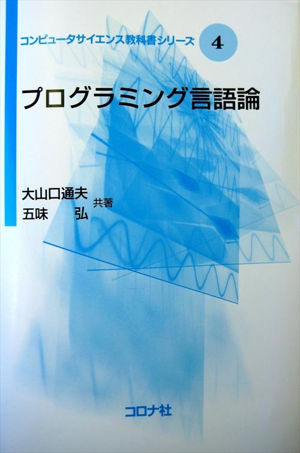

<!--
hi-lock: (("^!!!.*" (0 "hi-red-b" t)))
hi-lock: (("^\\?\\?\\?.*" (0 "hi-red-b" t)))
hi-lock: end
-->

# 講義の概要

## 講義のねらい
本講義の目的はプログラミング言語を深く理解することである．
特定のプログラミング言語を用いたプログラミングスキルの習得が目的ではない．
実践ではなく理論の講義であることを認識しておくこと．

例えば以下のC言語のソースプログラムが与えられたときに；
```java title="C言語による偶数判定プログラムの例"
int isEven(int n) {
  if (n % 2 == 0) {
    return 1;
  }
  return 0;
}
```

以下のような問いに答えられるようになることが目的である．

- なぜC言語はこのような構文となっているのか？
- C言語の設計者はどういう考えに基づいてこの構文を採用したのか？
- この構文でなぜコンピュータが動作するのか？
- これ以外の構文は存在するのか？本質的に何が違うのか？

!!! note
    プログラミング言語 ＝ 計算機言語

プログラミング言語を理解するとは，プログラミング言語とその計算モデル（仮想計算機）を理解することである．
言い換えると，プログラミング言語の理解とは，ソースプログラムをそれと等価な中間コードに翻訳する過程（コンパイル）の理解である．

CやJavaなどの命令型プログラミング言語を中心に説明する．
関数型言語や論理型言語についてもその特性を説明する．


## 授業の進め方

基本は教科書に準拠する．
また，教科書の内容を噛み砕いた[Webサイト](https://kusumotolab.github.io/lecture-program-lang/)に従って授業を進める．


教科書：「[プログラミング言語論](https://www.coronasha.co.jp/np/isbn/9784339027044/)」，コロナ社，ISBN978-4-339-02704-4

??? info "教科書の表紙"
    

可能な限り分かりやすい説明を試みるが，理論の講義であるため抽象的で捉えにくい部分もある．
自発的な学習が必須である点を認識しておくこと．

## 成績評価
講義への参加姿勢，および中間試験と期末試験の合計点により成績を決める．
