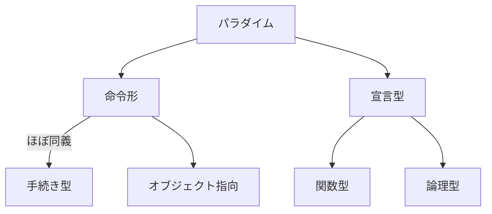

<!--
hi-lock: (("^!!!.*" (0 "hi-red-b" t)))
hi-lock: (("^\\?\\?\\?.*" (0 "hi-red-b" t)))
hi-lock: end
-->

# プログラミング言語の特徴と分類
<span class="md-tag">教科書2章</span>

## プログラミングパラダイム

プログラミングパラダイムとは，プログラミング言語が持つプログラムの規範や哲学のことである．



例えば，FortranやC言語，Pythonは命令型（≒手続き型）のパラダイムに従って設計されている．
命令形では命令（四則演算や比較，代入等）の逐次的な列挙によってプログラムを実現する．

```c title="C言語による加算処理"
int sum = 0;
for (int i = 0; i < 10; i++) {
  sum += i;
}
return sum;
```

```py title="Pythonによる加算処理"
sum = 0
for i in range(10):
    sum += i
return sum
```

パラダイムが異なる言語は，その大原則となる規範や哲学が異なるため記法が大幅に変わる．
LispやScalaは関数型パラダイムを採用しており，命令形言語とは別の考えに従っている．
関数型の詳細については[別の講義回](../prog-functional/)で触れる．

```lisp title="Lispによる加算処理"
(loop for i from 1 to 10 sum i)
```

世の中には様々なパラダイムが存在している．
新たなプログラミング言語を学ぶ際は，その言語がどのパラダイムを採用しているかをよく考えると良い．


!!! warning
    パラダイムは規範であり厳密な定義はできない．
    書籍や文献によって様々な解釈がある点に注意すること．
    命令形と手続き型は同一視されることが多い．
    命令形と宣言型は基本的に対義関係にある．
    
!!! note
    昨今は複数のパラダイムを採用したマルチパラダイム言語が一般的である．
    各種パラダイムの利点を組み合わせて良い言語を設計している．
    例えばJavaはオブジェクト指向言語であるが，部分的に関数型の機構（ラムダ式やStream API等）を採り入れている．
    

教科書によると，計算モデルを共有するプログラミングの枠組みをプログラミングパラダイムと定義している．
すなわち「パラダイムの違い＝規範や哲学の違い＝計算モデルの違い」と捉えることができる．
以降では，命令形パラダイムが採用するノイマン型コンピュータについて説明する．

## ノイマン型コンピュータ
??? info "John von Neumann"
    
    
    copyright by [^1]

[^1]: http://www.lanl.gov/history/atomicbomb/images/NeumannL.GIF


プログラムとデータを記憶装置に格納し，順番に読み込んで実行するコンピュータである．
現在のほとんど全てのコンピュータがノイマン型に相当する．
以降ではノイマン型コンピュータを単にコンピュータと呼ぶ．


命令形は最初に生まれたパラダイムであり，コンピュータの基本動作と密接に


命令形パラダイムが採用する計算モデルはノイマン型コンピュータである．


コンピュータは中央処理装置，記憶装置，入出力装置の3つから構成される．

## 論理モデルRAM


random-access machine


ニクラウス・ヴィルトの有名な言がある．

> アルゴリズム＋データ構造＝プログラム


## フォンノイマン型コンピュータ

プログラムとデータの両方を記憶装置に格納し，順番に読み込んで実行するコンピュータである．
現在のほとんど全てのコンピュータがノイマン型に相当する．
以降ではノイマン型コンピュータを単にコンピュータと呼ぶ．

コンピュータは中央処理装置，記憶装置，入出力装置の3つから構成される．


```java
load 3  // 3番地のデータを読み込む
```

## 論理モデルRAM
random-access machine

!!! note
    ランダムは「任意の」という意味であり「無作為」の意味ではない．
    順序に従ってのみアクセスできるというテープの性質と対比するための用語．

