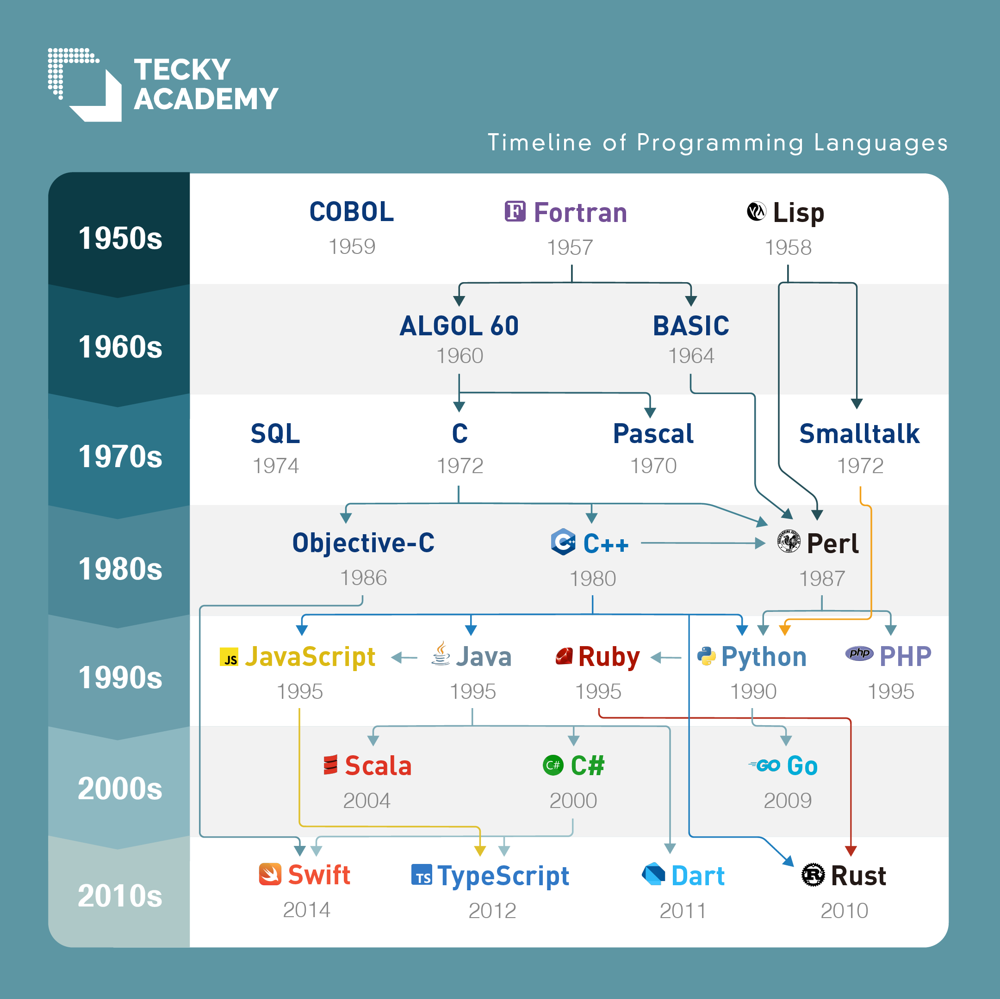

<!--
hi-lock: (("^!!!.*" (0 "hi-red-b" t)))
hi-lock: (("^\\?\\?\\?.*" (0 "hi-red-b" t)))
hi-lock: end
-->

# 序論
<span class="md-tag">教科書1章</span>


## 機械語
機械語とは0と1のビット列で構成される命令列である．


```title="機械語プログラムの一例"
0000 0000 0001
0001 0000 0010
0010 0000 0011
```
機械語プログラムはコンピュータが直接理解できる言語であり，機械語，すなわちCPUへの指示（命令）が列挙される．
CPUへの指示としては，データ転送の指示（`load` `store`等）や四則演算（`add` `sub`等）が含まれる．


## アセンブリ言語
機械語プログラムは人間にとって分かりやすいものではない．
この問題を軽減するためにアセンブリ言語が開発された．
基本的に機械語の命令列を1対1でアセンブリ命令に置き換える．

以下は，単一のレジスタ(1)を持つ極めてて単純なコンピュータのアセンブリ言語プログラムと，対応する機械語プログラムの一例である．
{ .annotate }

1. レジスタとはCPUに内蔵された記憶装置のこと．主記憶装置（メモリ）とは別物である点に注意．

```title="単純なアセンブリ言語プログラム"
load B     // メモリ1番地（記号番地B）の内容を演算レジスタに転送
add C      // 演算レジスタの内容にメモリ2番地（C）の値を加算
store A    // 演算レジスタの内容をメモリ3番地（A）に格納
```


```title="対応する機械語プログラム"
0000 0000 0001   // load B
0001 0000 0010   // add C
0010 0000 0011   // store A
```

```title="上記プログラムの挙動"
レジスタ    メモリ
           1  2  3  番地
           B  C  A  記号番地
--------------------------------
    0      4  5  6  格納されている値（初期状態，値に意味はない）
--------------------------------
    4      4  5  6  load B  
    9      4  5  6  add C   
    9      4  5  9  store A 
```

```title="上記プログラムで実現したい操作"
a <- b + c
```


## 高級言語
アセンブリ言語によって，01の列挙ではなく意味のある操作（`load` `store`等）の記述が可能になった．
また記号番地（`A` `B`等）も利用できる．
しかし，機械語命令とアセンブリ命令は相変わらず1対1の関係にあり，人間の思考レベルで考えると低水準である．
人間がその意味を知っている，抽象度の高い概念を用いるべきである．

!!! bug "Quiz"
    次の低水準指示の意味を考えよ．
    
    「親指と小指と薬指を折り曲げて，人差し指と中指をまっすぐに伸ばし，手のひら側を相手に向けよ」
    ??? success "Answer"
        「ピースサインをしろ」 :fontawesome-regular-hand-peace:

この人間の思考レベルとアセンブリ言語の隔たりを埋める方法として高級言語が開発された．
最初の高級言語はFortranである．

```fortran title="Fortranによる加算プログラム"
a = b + c
```

C言語やJava，Python，Rustなどは高級言語である．
現在でも新たなプログラミング言語が提案され続けている．
<!-- 昨今のソフトウェア開発のほとんどは高級言語が利用される．-->

??? info "プログラミング言語の歴史"
    
    copyright by [^1]

[^1]: Gordon Lau, https://tecky.io/en/blog/evolution-of-programming-languages/

## コンパイラ

高級言語で記述されたプログラムは，コンピュータが直接理解し実行できる機械語へ翻訳される必要がある．
この翻訳作業をコンパイル，翻訳システムをコンパイラと呼ぶ．
```title="コンパイルの流れ"
高級言語のプログラム  (e.g., a = b + c)
      ↓ 入力
  [コンパイラ]
      ↓ 出力
機械語のプログラム    (e.g., 0000 0000 0001 ..)
```

```sh title="Cプログラムのコンパイル"
$ gcc sample.c
```


## プログラミング言語とは？

目的：
:   プログラミングの労力を軽減すること

必須条件：
:   ①プログラムを書く記法が定義されていること（CF文法やBNFによって定義）
:   ②コンパイラが実現できること（機械語に翻訳可能であること）

持つべき望ましい特性：
:   ①簡潔・明晰な表現機構
:   ②高い記述能力
:   ③プログラムに明確で曖昧さの無い意味を与えられること
:   ④プログラムの信頼性・再利用性・テスト容易性を高める機構
:   ⑤高品質のコードを生成するコンパイラが実現可能
