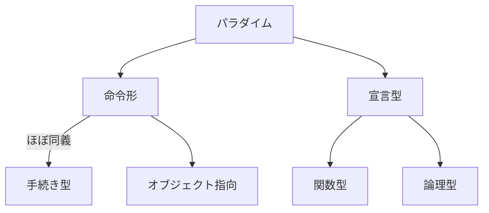
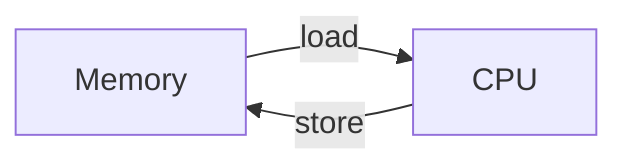

<!--
hi-lock: (("^!!!.*" (0 "hi-red-b" t)))
hi-lock: (("^\\?\\?\\?.*" (0 "hi-red-b" t)))
hi-lock: end
-->

# プログラミング言語の特徴と分類
<span class="md-tag">教科書2章</span>

## プログラミングパラダイム

プログラミングパラダイムとは，プログラミング言語が持つプログラムの規範や哲学のことである．
以下の図は代表的なパラダイムの親子関係である．



例えば，FortranやC言語，Pythonは命令型（≒手続き型）のパラダイムに従って設計されている．
命令形では命令（四則演算や比較，代入等）の逐次的な処理によってプログラムを実現する．

```c title="C言語による0～10の加算処理"
int sum = 0;
for (int i = 0; i < 10; i++) {
  sum += i;
}
printf("%d", sum);
```

```py title="Pythonによる0～10の加算処理"
sum = 0
for i in range(11):
    sum += i
print(sum)
```

パラダイムが異なる言語は，その大原則となる規範や哲学が異なるため記法が大幅に変わる．
LispやScalaは関数型パラダイムを採用しており，命令形とは別の考えに従っている．
その大原則は関数適用（application）の繰り返しである．
関数型の詳細については[別の講義回](../prog-functional/)で触れる．

```lisp title="Lispによる0～10の加算処理"
(format t "~d"
  (loop for i from 1 to 10 sum i))
```

パラダイムは規範であり厳密な定義はできない．
書籍や文献によって様々な解釈がある点に注意すること．
命令形と手続き型は同一視されることが多い．
命令形と宣言型は基本的に対義関係にある．

!!! note
    音楽のロックというジャンルを厳密に定義できないのと同様である．

世の中には様々なパラダイムが存在している．
新たなプログラミング言語を学ぶ際は，その言語がどのパラダイムを採用しているかを強く意識すること．
    
!!! note
    昨今は複数のパラダイムを採用したマルチパラダイム言語が一般的である．
    各種パラダイムの利点を組み合わせて良い言語を設計している．
    例えばJavaはオブジェクト指向言語であるが，部分的に関数型の機構（ラムダ式やStream API等）を採り入れている．
    
    パラダイムは排他的ではなく共存可能である．

教科書では，**計算モデル**を共有するプログラミングの枠組みをプログラミングパラダイムと読んでいる．
すなわち「パラダイムの違い＝規範や哲学の違い＝計算モデルの違い」と捉えることができる．
以降では，命令形パラダイムが採用する計算モデル，ノイマン型コンピュータについて説明する．

## ノイマン型コンピュータ
??? info "John von Neumann"
    
    &copy;[^1]

[^1]: http://www.lanl.gov/history/atomicbomb/images/NeumannL.GIF


プログラムとデータを記憶装置に格納し，順番に読み込んで実行するコンピュータである．
現在のほとんど全てのコンピュータがノイマン型に相当する．
以降ではノイマン型コンピュータを単にコンピュータと呼ぶ．

!!! note
    量子コンピュータは非ノイマン型である．

<!-- 命令形は最初に生まれたパラダイムであり，コンピュータの基本動作と密接に関わっている．-->
コンピュータの基本構成は以下の通りである．単純化のために入出力装置を省略している．



コンピュータの基本動作は以下3ステップである．

1. メモリからデータをCPUへ転送（`load`）
2. 演算の実行（`add`等）
3. 結果をCPUからメモリへ格納（`store`）

[序論で示したアセンブリ](../pre-intro/#_3)の動作と同一である．

```text title="単純なアセンブリ言語プログラム（再掲）"
load B
add C
store A
```

この`load`→`any process`→`store`の操作を抽象化すると，右辺に式を持つ代入文とみなせる．

```c title="C言語の代入文"
<変数名> = <式>;  // A = B + C;
```

命令型言語はこのような代入文の繰り返しによって，変数の値を動的に変化させ計算を行う点に特徴がある．
まとめると命令型言語は以下の特徴を持つ．

基本要素：
:    変数 ... データと計算結果を保持
:    文　 ... 代入文（`=`）や制御文（`if`，`for`）など

特徴：
:    ①代入文の繰り返しで計算を行う
:    ②プログラムは文の並びであり，逐次的に実行する
:    ③代入文によって変数の値を動的に変化させて計算する


!!! note annotate
    この時点で驚きのある内容ではないはず．皆さんのよく知る一般的なプログラミング言語(1)の挙動である．
    
1. CやPython等の命令形パラダイムの言語のこと．


## RAM
ノイマン型コンピュータをさらに単純化した論理的な計算モデル，RAM（random-access machine）を考える．
命令形パラダイムの本質を理解するためである．

!!! note
    ここでのランダムは「任意の」という意味であり「無作為」の意味ではない．
    メモリの任意の場所にアクセスできる機械という意味である．
    順序に従ってのみアクセスできるという，チューリングマシン（TM）のテープと対比するための用語．
    
    現在のメモリはランダムアクセスが可能なため，TMよりもRAMの方が現実に近い．


RAMは1個のレジスタ`c(0)`を持つ．
メモリは複数のメモリセルで構成されており，上から順に`c(1)` `c(2)`...と呼ぶ．
ここでは入出力テープは省略して考える．

```text title="RAMの構成"
■ プログラム
load A   ← プログラムカウンタ（基本は一つずつ逐次的に進む）
add B
store C

■ 記憶装置
c(0) [ 0 ] レジスタ
c(1) [ 2 ] メモリ
c(2) [ 5 ]   〃
 ..    ..    〃
```

機械語命令は演算コードとオペランドの組で構成される．
```text title="機械語命令の構成"
<演算コード> <オペランド>   // load 1
```

演算コードは次の12個である．

- 転送命令 `load`
- 格納命令 `store`
- 四則演算 `add` `sub` `mult` `div`
- 制御命令 `jump` `jgtz` `jzero`
- 停止命令 `halt`
- 入力命令 `read` (無視してOK)
- 出力命令 `write` (無視してOK)

オペランドには定数，番地，間接番地のいずれかを指定できる．

- `#i` ... 定数`i`を指定
- $~~$`i` ... セル`c(i)`を指定（直接アドレス）
- `*i` ... セル`c(c(i))`を指定（間接アドレス）


`load`と`store`に対する具体的なRAMの挙動を示す．
`load`と`store`の主体は常に`c(0)`と考えると良い．

```text title="load命令に対するRAMの動作例"
命令        挙動            メモリ
-----------------------------------------------------------------
load #1    c(0)←1          c(0) [   ]  // → 1

load 1     c(0)←c(1)       c(0) [   ]  // → 2
                           c(1) [ 2 ]  // この値をc(0)へ転送

load *1    c(0)←c(c(1))    c(0) [   ]  // → 5
                           c(1) [ 2 ]
                           c(2) [ 5 ]  // この値をc(0)へ転送
```

```text title="store命令に対するRAMの動作例"
命令        挙動            メモリ
-----------------------------------------------------------------
store #1   これはNG

store 1    c(0)→c(1)       c(0) [ 0 ]  // この値をc(1)に格納
                           c(1) [   ]  // → 0

store *1   c(0)→c(c(1))    c(0) [ 0 ]  // この値をc(c(1))に格納
                           c(1) [ 2 ]
                           c(2) [   ]  // → 0
```


機械語命令にはジャンプのためのラベルを付与することもできる．
```text title="機械語命令の構成"
<ラベル>: <演算コード> <オペランド>   // loop: load 1
```

RAMの機械語プログラムは先頭から逐次的に実行されるが，制御命令（`jump` `jgtz` `jzero`）によって，命令のジャンプが可能である．
例えば`jump loop`は`loop:`ラベルの命令へ制御を移動する．
実際には，プログラムカウンタの値をそのラベルの値に変更することにより，ジャンプを実現している．
<!--無条件ジャンプ`jump`と条件付きジャンプ`jgtz` `jzero`が存在する．-->

| 命令      | 動作                                              |
|-----------|---------------------------------------------------|
| `load a`  | `c(0)` ← `c(a)`                                  |
| `store a` | `c(0)` → `c(a)`                                  |
| `add a`   | `c(0)` ← `c(0) + c(a)`                           |
| `jump b`  | プログラムカウンタ ← `b`                         |
| `jgtz b`  | プログラムカウンタ ← `b`，ただし`c(0) > 0`ならば |
| `jzero b` | プログラムカウンタ ← `b`，ただし`c(0) = 0`ならば |
| `halt`    | 実行終了                                          |

    

